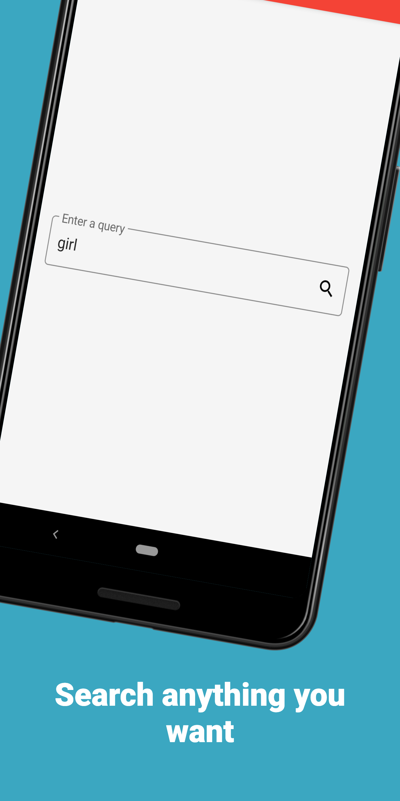

# Kotlin Application Relies On TDD - Coroutines and Modularization

[](https://app.codacy.com/app/nuhkoca/kotlin-modular-tdd-coroutines-mvvm?utm_source=github.com&utm_medium=referral&utm_content=nuhkoca/kotlin-modular-tdd-coroutines-mvvm&utm_campaign=Badge_Grade_Settings)
[](https://codebeat.co/projects/github-com-nuhkoca-kotlin-modular-tdd-coroutines-mvvm-master)
[](https://www.codefactor.io/repository/github/nuhkoca/kotlin-modular-tdd-coroutines-mvvm)
[](https://circleci.com/gh/nuhkoca/kotlin-modular-tdd-coroutines-mvvm/tree/master)
[](https://kotlinlang.org)
[](https://android-arsenal.com/api?level=21)
<a href="https://opensource.org/licenses/MIT"></a>


[](https://ktlint.github.io/)


TVmaze is a community of TV lovers and dedicated contributors that discuss and help maintain tv information on the web.

<p align="center">
  <a href="https://www.tvmaze.com/api"></a>
</p>

A [TvMaze Client App](https://www.tvmaze.com/) which was built with modular structure, Kotlin DSL, Kotlin Coroutines, DataBinding, Test Driven Development and MVVM pattern.

Users are able to search tv series by query.

>Networking was handled by Coroutines and Retrofit. It is very simple with the Coroutines support of Retrofit

>The dependency management is managed by buildSrc module.

>[Material Components](https://github.com/material-components/material-components-android) were used for UI.

>[Detekt](https://github.com/arturbosch/detekt) and [Ktlint](https://github.com/JLLeitschuh/ktlint-gradle) plugins were used for static code analysis.

>The repository is tracked by the CI tool [CircleCI](https://circleci.com/)

#### Screenshots


| Search screen | List screen | Error screen
|:----------------:|:---------------: |:---------------:
|   |   | 


#### In Progress
*Kotlin DSL doesn't support to write common scripts among all child gradle files at the moment. When it is supported, it will be implemented in the repository.*

### Architecture :triangular_ruler: 
* [Clean Architecture](https://www.amazon.com/Clean-Architecture-Craftsmans-Software-Structure/dp/0134494164)
* [MVVM](https://www.raywenderlich.com/8984-mvvm-on-android)

### Patterns 
* [Repository Pattern](https://developer.android.com/jetpack/docs/guide)
* [Observer Pattern](https://code.tutsplus.com/tutorials/android-design-patterns-the-observer-pattern--cms-28963)
* [UseCase Pattern](https://caminao.blog/how-to-implement-symbolic-representations/patterns/functional-patterns/use-case-patterns/)
* [Delegation Pattern](https://en.wikipedia.org/wiki/Delegation_pattern)

### Approaches
* [SOLID Principle](https://itnext.io/solid-principles-explanation-and-examples-715b975dcad4?gi=79443348411d)
* [TDD](https://technologyconversations.com/2013/12/20/test-driven-development-tdd-example-walkthrough/)

### Technology Stack :hammer_and_wrench: 
* [Kotlin](https://kotlinlang.org/)
* [Kotlin DSL](https://docs.gradle.org/current/userguide/kotlin_dsl.html)
* [DataBinding](https://developer.android.com/topic/libraries/data-binding)
* [Dagger 2](https://github.com/google/dagger)
* [Coroutines](https://kotlinlang.org/docs/reference/coroutines-overview.html)
* [Retrofit 2](https://square.github.io/retrofit/)
* [Android Jetpack](https://developer.android.com/jetpack)
  * [LiveData](https://developer.android.com/topic/libraries/architecture/livedata)
  * [ViewModel](https://developer.android.com/topic/libraries/architecture/viewmodel)
  * [ConstraintLayout](https://developer.android.com/training/constraint-layout)
* [Glide](https://github.com/bumptech/glide)
* [MockK](https://mockk.io/)
* [Detekt](https://github.com/arturbosch/detekt)
* [Ktlint](https://github.com/JLLeitschuh/ktlint-gradle)

### Layers
* Data(This layer is responsible to hold models)
* Domain(Retrieves data from data layer and dispatches to view layer. No connection with Android framework.)
* Base(Contains common stuff for other layers)
* View(Responsible for UI stuff such as displaying data)

### To-Do List:
- [ ] - A detail screen to be added
- [ ] - Cards to have more detail
- [x] - Some screenshots to be added
- [ ] - Write common DSL scripts

```
MIT License

Copyright (c) 2019 Nuh Koca

Permission is hereby granted, free of charge, to any person obtaining a copy
of this software and associated documentation files (the "Software"), to deal
in the Software without restriction, including without limitation the rights
to use, copy, modify, merge, publish, distribute, sublicense, and/or sell
copies of the Software, and to permit persons to whom the Software is
furnished to do so, subject to the following conditions:

The above copyright notice and this permission notice shall be included in all
copies or substantial portions of the Software.

THE SOFTWARE IS PROVIDED "AS IS", WITHOUT WARRANTY OF ANY KIND, EXPRESS OR
IMPLIED, INCLUDING BUT NOT LIMITED TO THE WARRANTIES OF MERCHANTABILITY,
FITNESS FOR A PARTICULAR PURPOSE AND NONINFRINGEMENT. IN NO EVENT SHALL THE
AUTHORS OR COPYRIGHT HOLDERS BE LIABLE FOR ANY CLAIM, DAMAGES OR OTHER
LIABILITY, WHETHER IN AN ACTION OF CONTRACT, TORT OR OTHERWISE, ARISING FROM,
OUT OF OR IN CONNECTION WITH THE SOFTWARE OR THE USE OR OTHER DEALINGS IN THE
SOFTWARE.
```
